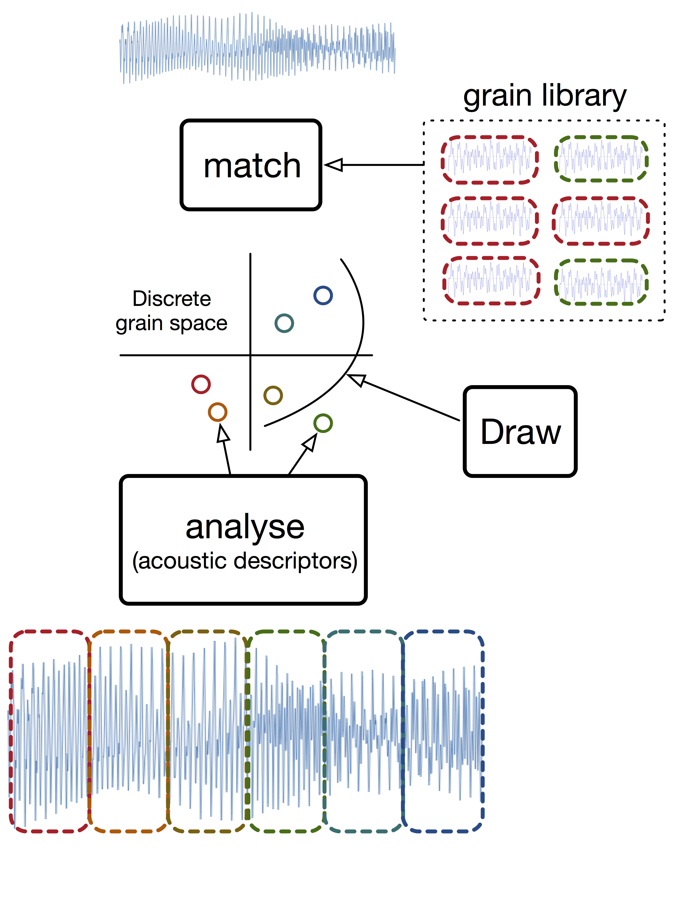
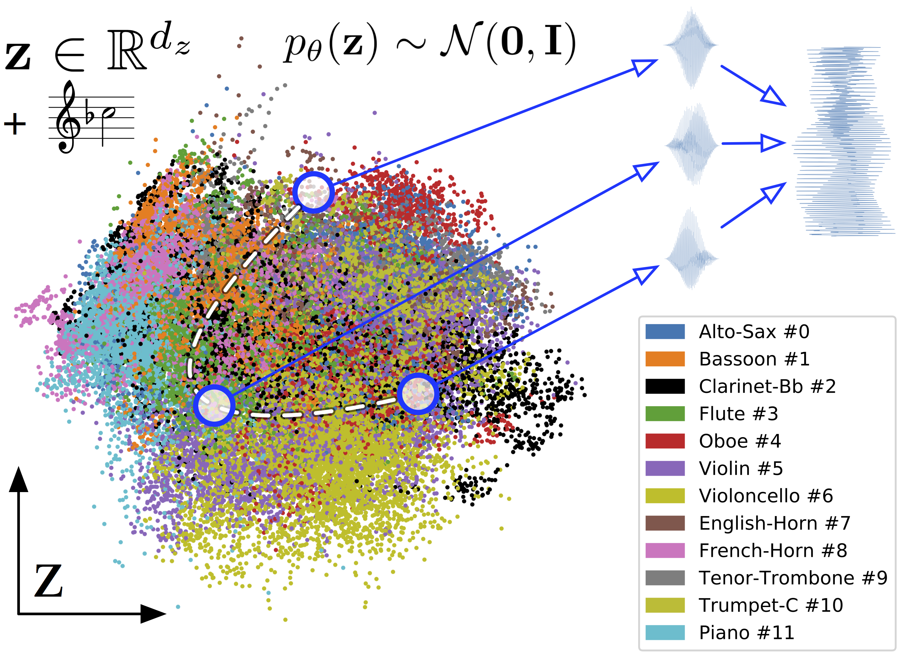

<!--
<a href="audio/Crash_s_note.wav">sample_embed_crash</a>
https://jekyllcodex.org/without-plugin/open-embed/#
-->

&nbsp;

*This page is under construction, sound and video examples are being added prior to the reviewing process. Stay tuned during that period and after, more experiments may be uploaded !*

&nbsp;

[paper draft](https://github.com/anonymized124/neural_granular_synthesis/blob/master/draft.pdf)

&nbsp;

## MOTIVATION FOR NEURAL GRANULAR SOUND SYNTHESIS

Previous methods of granular sound synthesis. A library of audio grains is analysed with acoustic descriptors, forming a discrete grain space. A target signal can be analyzed following the same procedure. By matching the scattered library to these target grains, a waveform is assembled to resynthesize the target signal. Alternatively some curves can be drawn in the grain space, and synthesized using the neighboring library grains.

  

&nbsp;

Neural granular sound synthesis adresses the limitations of the non-invertible discrete grain space and arbitrary analysis dimensions, using latent variables of a generative neural network (VAE) as substitutes to the acoustic descriptors. The encoder learns a continuous grain space and analysis dimensions that are directly invertible to waveform domain with the decoder. A target sound can be analysed and decoded, as well as continuous latent paths. Moreover, by training a sequential embedding over the latent grain space, we can as well sample sounds with a temporal structure such as musical notes and drum hits. Model variants include as well decoder contioning, using some data or user labels, we can control some target sound quality in the synthesis process (eg. pitch, instrument class) in order to allow interactions and composition.

  

&nbsp;

## MODEL ARCHITECTURE

  

&nbsp;

## GRANULAR LATENT SPACE

  

2D visualization (with Principale Component Analysis, *PCA*) of a learned grain space over individual pitched notes of orchestral instruments (from *SOL* dataset and subsequent coloring). Grains can be synthesized from any latent position, such as along a continuous free-synthesis path, and overlap-add into a waveform. A pitch target can be added.

&nbsp;

## SOUND EXAMPLES FROM THE TRAINED MODELS

*All sound/video examples are raw outputs of the models (besides inputs for the reconstructions and resynthesis), without any kind of audio effect/processing added.*

&nbsp;

### RECONSTRUCTIONS

Data reconstructions (each pair of sounds is input/reconstruction).

&nbsp;

### SAMPLING

Structured one-shot audio clips generated from models with recurrent embedding and conditioning.

* trained on the Drum dataset:
<audio id="player" controls><source src="audio/drum_samples.wav"></audio>

* trained on the Methlab sample pack:
<audio controls><source src="audio/methlab_sample.wav"></audio>

* trained on the SOL dataset (instruments of the orchestra playing *ordinario*):
<audio controls><source src="audio/ordinario_samples.wav"></audio>

* trained on the SOL dataset (stringed instruments):
<audio controls><source src="audio/string_samples.wav"></audio>

&nbsp;

### FREE-SYNTHESIS

Continuous traversals in the latent grain space.

* linear interpolations for ESC-50 in Cat, Crow, Sheep:
<audio controls><source src="audio/cat_crow_sheep_interp.wav"></audio>

* linear interpolations for the orchestra playing *ordinario*:
<audio controls><source src="audio/ordinario_interp.wav"></audio>

* linear interpolations for stringed instruments:
<audio controls><source src="audio/string_interp.wav"></audio>

* linear interpolations for Clarinet:
<audio controls><source src="audio/clar_interp.wav"></audio>

* linear interpolations for Piano:
<audio controls><source src="audio/piano_interp.wav"></audio>

* linear interpolations in the Methlab model:
<audio controls><source src="audio/methlab_interp.wav"></audio>

* forward-backward linear interpolations in the Drum model:
<audio controls><source src="audio/drum_fb.wav"></audio>

* forward-backward linear interpolations in the Methlab model:
<audio controls><source src="audio/methlab_fb.wav"></audio>

* forward-backward / circular / spiral for the orchestra playing *ordinario*:
<audio controls><source src="audio/ordinario_fb_circ_spir.wav"></audio>

&nbsp;

### DATA-DRIVEN RESYNTHESIS

Audio style transfer (first sound is the target, followed by diverse resynthesis outputs from the models)

* a *Pizzicato* (Cello) played as Drums:
<audio controls><source src="audio/pizz_drum.wav"></audio>

* a *Tremolo* (Cello) played as Cat, Drum, Piano:
<audio controls><source src="audio/trem_cat_drum_piano.wav"></audio>

* a Clarinet solo played as Cat, Rooster, Cow, Sheep, Dog:
<audio controls><source src="audio/csolo_cat_rooster_cow_sheep_dog.wav"></audio>

* a Violin solo played as Cat, Sheep, Cow, Cow, Frog:
<audio controls><source src="audio/vsolo_cat_sheep_cow_frog.wav"></audio>

* a synthesizer sound played as Clarinet, Methlab, Piano, String:
<audio controls><source src="audio/synth1_clari_met_piano_string.wav"></audio>

* a synthesizer sound played as Cat, Methlab, orchestra playing *ordinario*:
<audio controls><source src="audio/synth0_cat_met_ord.wav"></audio>

&nbsp;

## EXAMPLE INTERFACES

With GPU support, for instance a sufficient dedicated laptop chip or an external thunderbolt hardware, the models can be ran in real-time. In order to apply trained models to these different generative tasks, we currently work on some prototype interfaces based on a [Python OSC](https://pypi.org/project/python-osc/) server controlled from a [MaxMsp](https://cycling74.com) patch.

&nbsp;

### NEURAL DRUM MACHINE

Using a model with sequential embedding and conditioning trained over the *8  Drums* dataset classes, we can sample structured one-shot audio clips for each of the drum classes. Since its embedding is continuous, we can explore a great diversity of sounds. Moreover, we can alternatively sample random paths to explore other spectro-temporal dynamics. Once the samples are chosen, they can be played-back in realtime with a 8-track step sequencer, without having an actual sample library but only a generative neural network to write the buffers.

*The videos are made while running the model on a MacbookPro Retina 2015 **(without GPU)**, some latency can be seen when sampling and writing the buffers. Such latency is however low and given a GPU it could be sampled in real-time by the step sequencer rather than played-back.*

[Screenshot](https://raw.githubusercontent.com/anonymized124/neural_granular_synthesis/master/figures/screen_drum_machine.png)

The upper integer box selects the drum condition sent to the model. The trigger to the message **sample_note** generates a drum hit from the recurrent embedding. The trigger to the message **sample_path** draws a randomized linear path in the grain space, of same length that the embedding sample. This can be seen in the python console on the left side, answering to the messages sent through OSC. While the step sequencer loops, it is possible to resample some drum sounds that overwrite the previous buffer.

<video id="drum_machine" class="video-js vjs-default-skin" controls preload="auto" width="600" height="288" data-setup="{}">
<source src="video/drum_machine.mp4" type='video/mp4'>
</video>

&nbsp;

### NEURAL *DRUM AND BASS* MACHINE

For this one, a model trained on the 10 classes of the *Methlab sample pack* is used with a corresponding 10-track step sequencer. The process is similar to the previous video, but the classes of sounds are more ambiguous and not restricted to one-shot samples.

[Screenshot](https://raw.githubusercontent.com/anonymized124/neural_granular_synthesis/master/figures/screen_methlab_machine.png)

&nbsp;

Example of loop generated with this step sequencer and model: <audio controls><source src="audio/test_methlab_drummachine.wav"></audio>

&nbsp;

<video id="methlab_machine" class="video-js vjs-default-skin" controls preload="auto" width="600" height="288" data-setup="{}">
<source src="video/methlab_machine.mp4" type='video/mp4'>
</video>
