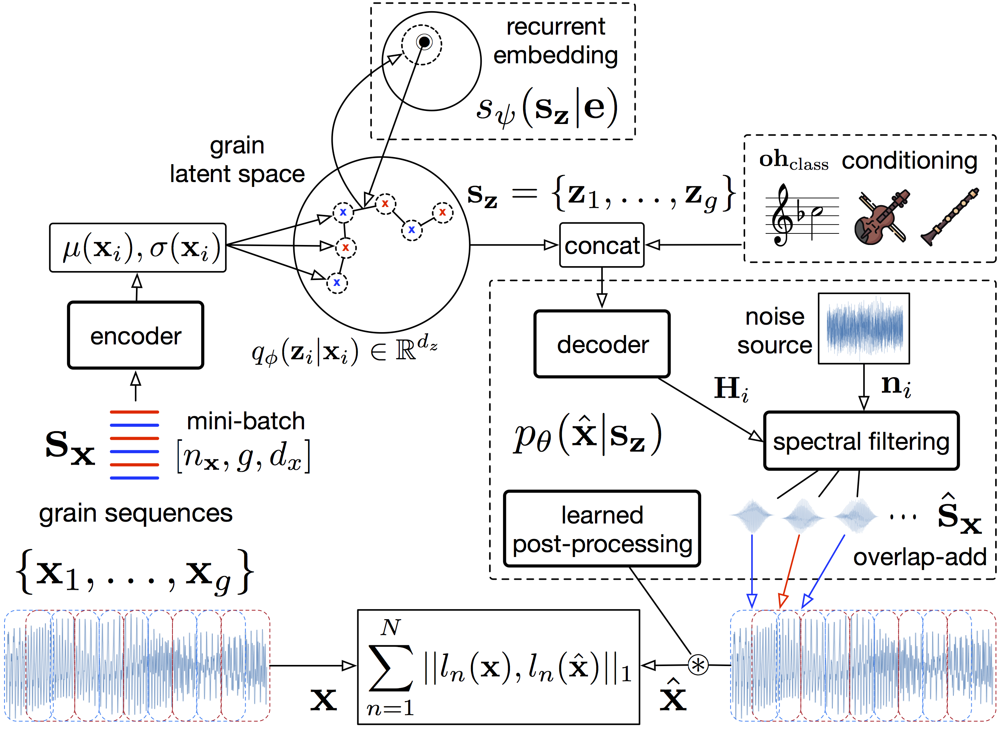
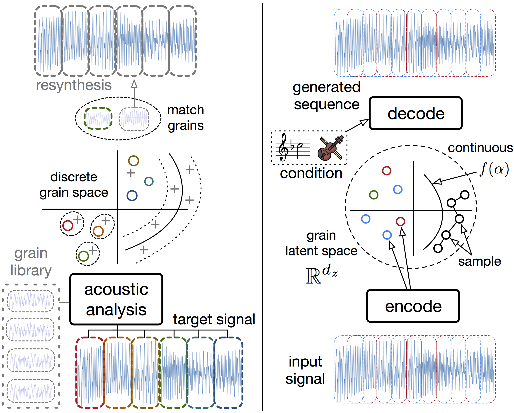

<link href="style.css" rel="stylesheet">

<!--
<audio controls><source src="audio/cat_crow_sheep_interp.wav"></audio>
and edit style.css for the size

  

-->

*This page is under construction, sound and video examples are being added for the reviewing process. Stay tuned during that period and after, more experiments may be uploaded !*

&nbsp;

[paper submission](https://github.com/anonymized124/neural_granular_synthesis/blob/master/neural_granular_synthesis_submission.pdf)

&nbsp;

## Motivation for Neural Granular Sound Synthesis

In the left, a granular synthesis space is formed by analysing a library of audio grains, scattered as (+), with acoustic descriptors. These dimensions allow for visualization and control of the synthesis. A free-synthesis path can be drawn or a target criterion can be formed by analysing the grain series of an other signal (o). Grains from the library can be then selected by matching these targets with respect to acoustic descriptor values.

Some limitations arise in this process. Amongst others, the acoustic descriptors are not invertible so it is not possible to synthesize from them, besides the scattered library grain coordinates. The quality of the analysis is bound by the choice and design of acoustic descriptors, which only account for local audio similarities. Thus this space does not organize the longer temporal structure of audio events such as notes or drum hits, which cannot be generated without features extracted from an other corresponding target signal.

In the right, developping a raw waveform Variational Auto-Encoder to learn a grain latent space, we alleviate some of these limitations and enable new generative processes based on concepts of granular sound synthesis. Its learned analysis dimensions are continuously invertible to the signal domain. We can thus synthesize along any path, without need to store the grain library after the training. An other sound sample can be auto-encoded, to perform resynthesis, with some possible additional user controls to condition the decoder generation. On top of this grain-level representation, we can efficiently train a recurrent embedding on contiguous grain series to learn meaningful temporal paths within the latent grain space. As a result, the model can sample structured audio envents such as note and drum hits, as well as morph their features.

&nbsp;

  

&nbsp;

## Model architecture

This figure details the complete Variational Auto-Encoder (VAE) model. The lower VAE encodes grain series into latent series, which are fed to the subtractive noise synthesis decoder. It can be conditionned with concatenation of one-hot user labels. The decoded grain series are overlap-add into a waveform. A second recurrent VAE can be trained on contiguous series of latent features, to learn structured paths in the grain space. Performing this temporal modeling at the down-sampled grain level efficiently accounts for the longer-term relationships while the bottom VAE ensures the quality of the local grain features. Waveform synthesis is optimized with a multi-scale spectrogram reconstruction objective, to account for both transient and harmonic sound features.

&nbsp;

  

&nbsp;

## Granular latent space

2D visualization (with Principale Component Analysis, *PCA*) of a learned grain space over individual pitched notes of orchestral instruments (from *SOL* dataset and subsequent coloring). Grains can be synthesized from any latent position, at or besides these points of the database latent scatter.

&nbsp;

  

&nbsp;

## Structured waveform generation from the recurrent embedding

By using this two-level audio modeling, we can generate structured audio events such as musical notes or drum hits. In the first place, the top level embedding is sampled, a latent path is recurrently decoded. This series is fed to the bottom filtering noise decoder which outputs the corresponding waveform.

&nbsp;

  

&nbsp;

## Morphing of sound samples

By performing interpolations in the top level embedding, we can transition in between features at the scale of structured audio events. For instance, generating successive latent grain paths that correspond to evolving drum enveloppes, from snapped to more sustained/resonating.

&nbsp;

  

&nbsp;

## Sound examples from the trained models

Summary of the interactions in Neural Granular Sound Synthesis. In the left, structured latent paths can be sampled from the higher temporal embedding. In the middle, we can draw and freely synthesize along any latent trajectory. In the right, we can encode an other target signal and resynthesize it.

  

*All sound/video examples are raw outputs of the models (besides inputs for the reconstructions and resynthesis), without any kind of audio effect/processing added.*

&nbsp;

### Reconstructions

Data reconstructions (each pair of sounds is input/reconstruction).

&nbsp;

### Sampling

Using a model with temporal embedding, trained on the 8 classes of the *8 Drums* dataset, we can sample drum hits. In this order, a *crash*, a *kick*, a *ride*, a *snare* and a *tom*.

<audio controls><source src="audio/drums_snote_crash.wav"></audio> <audio controls><source src="audio/drums_snote_kick.wav"></audio> <audio controls><source src="audio/drums_snote_ride.wav"></audio> <audio controls><source src="audio/drums_snote_snare.wav"></audio> <audio controls><source src="audio/drums_snote_tom.wav"></audio>

Using such a model trained on *Studio-On-Line (SOL)* dataset, we can sample instrumental notes. In this order *violin*, *cello*, *clarinet*, *french-horn* and *piano*.

<audio controls><source src="audio/sol_snote_violin.wav"></audio> <audio controls><source src="audio/sol_snote_violin2.wav"></audio> <audio controls><source src="audio/sol_snote_cello.wav"></audio> <audio controls><source src="audio/sol_snote_cl.wav"></audio> <audio controls><source src="audio/sol_snote_frhorn.wav"></audio> <audio controls><source src="audio/sol_snote_piano.wav"></audio>

&nbsp;

### Free-synthesis

Variable length free-synthesis trajectories can be drawn accross the latent space, continuously inverting to grains and waveform. For instance, linear interpolations in the latent grain space of a model trained in *SOL*.

<audio controls><source src="audio/interp_ord_1.wav"></audio> <audio controls><source src="audio/interp_ord_2.wav"></audio> <audio controls><source src="audio/interp_ord_3.wav">

&nbsp;

### Data-driven resynthesis

&nbsp;

## Example interfaces

With GPU support, for instance a sufficient dedicated laptop chip or an external thunderbolt hardware, the models can be ran in real-time. In order to apply trained models to these different generative tasks, we currently work on some prototype interfaces based on a [Python OSC](https://pypi.org/project/python-osc/) server controlled from a [MaxMsp](https://cycling74.com) patch.

&nbsp;

### Neural Drum Machine

Using a model with sequential embedding and conditioning trained over the *8  Drums* dataset classes, we can sample structured one-shot audio clips for each of the drum classes. Since its embedding is continuous, we can explore a great diversity of sounds. Moreover, we can alternatively sample random paths to explore other spectro-temporal dynamics. Once the samples are chosen, they can be played-back in realtime with a 8-track step sequencer, without having an actual sample library but only a generative neural network to write the buffers.

*The videos are made while running the model on a MacbookPro Retina 2015 **(without GPU)**, some latency can be seen when sampling and writing the buffers. Such latency is however low and given a GPU it could be sampled in real-time by the step sequencer rather than played-back.*

[Screenshot](https://raw.githubusercontent.com/anonymized124/neural_granular_synthesis/master/figures/screen_drum_machine.png)

The upper integer box selects the drum condition sent to the model. The trigger to the message **sample_note** generates a drum hit from the recurrent embedding. The trigger to the message **sample_path** draws a randomized linear path in the grain space, of same length that the embedding sample. This can be seen in the python console on the left side, answering to the messages sent through OSC. While the step sequencer loops, it is possible to resample some drum sounds that overwrite the previous buffer.

<video id="drum_machine" class="video-js vjs-default-skin" controls preload="auto" width="600" height="288" data-setup="{}">
<source src="video/drum_machine.mp4" type='video/mp4'>
</video>

&nbsp;

### Neural *Drum and Bass* Machine

For this one, a model trained on 10 classes of a [Methlab](https://soundcloud.com/methlab-recordings) sample pack is used with a corresponding 10-track step sequencer. Classes are *Bass, Break, Cymbal, Fx, Hat, Kick, Lead, Pad, Perc, Snare*. We use a restricted set of 260 sound samples collected from their online music competitions. The process is similar to the previous video, but the classes of sounds are more ambiguous and not restricted to one-shot samples (e.g. loops).

[Screenshot](https://raw.githubusercontent.com/anonymized124/neural_granular_synthesis/master/figures/screen_methlab_machine.png)

&nbsp;

Example of loop generated with this step sequencer and model:
<audio controls><source src="audio/test_methlab_drummachine.wav"></audio>

&nbsp;

<video id="methlab_machine" class="video-js vjs-default-skin" controls preload="auto" width="600" height="288" data-setup="{}">
<source src="video/methlab_machine.mp4" type='video/mp4'>
</video>
